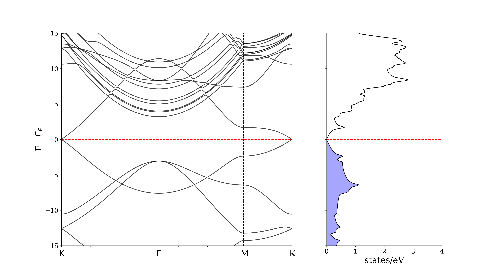

## Parte 1: Cálculos de Otimização Estrutural e Estrutura Eletrônica com o Quantum Espresso

Para calcular a estrutura eletrônica de um cristal, é preciso se certificar de que a estrutura está bem otimizada, ou seja, precisamos garantir que a estrutura esteja com a simetria e os parâmetros de rede corretos. Isso pode ser garantido conduzindo cálculos de otimização de geometria como o **relax** e o **vc-relax**. 

O tipo de cálculo a ser realizado pelo QE é controlado pela flag `calculation` no card **&CONTROL**. Os principais tipos de cálculos são: **scf**, **nscf**, **bands**, **relax** e **vc-relax**. Mais detalhes podem ser encontrados na [Documentação do pwscf](https://www.quantum-espresso.org/Doc/INPUT_PW.html).

Abaixo estão sumarizados algumas característica de cálculos de otimização estrutural:

- **Relax**: cálculo de otimização de geometria baseado na minimização da energia total, forças e estresse na estrutura. Esta otimização ocorre da seguinte forma: um cálculo auto-consistente é feito para obter a densidade de carga e consequentemente a energia da estrutura (Teorema de Hohenberg-Kohn). Com a energia, as forças entre os átomos é calculada por meio do teorema de Hellmann-Feynman. Caso os critérios de convergência (energia e forças) não sejam satisfeitos, os átomos são movidos (seguindo um esquema de minimização como o gradiente conjugado, por exemplo). Um novo cálculo auto-consistente é feito com os átomos nas novas posições e o procedimento é repetido até que todos os critérios de convergência sejam satisfeitos.

- **Vc-relax**: o procedimento feito pelo espresso para minimizar a energia e força da estrutura é semelhante ao relax, mas com o adicional de que agora, os parâmetros de rede são modificados para auxiliar no processo de minimização.


### Input do código pwscf do QE para o cálculo de otimização estrutural (com variação dos parâmetros de rede):
```
&CONTROL
    calculation='vc-relax'
    prefix='graphene'
    nstep=1000
    tprnfor=.true.
    outdir='./out'
    disk_io='default'
    pseudo_dir='../pseudos/'
    tstress=.true.
    forc_conv_thr=1.0d-4
    etot_conv_thr=1.0d-5
/
&SYSTEM
    ibrav = 4,
    a = 2.4674,
    c= 20.000,
    nat = 2,
    ntyp = 1,
    ecutwfc = 50.0 ,
    ecutrho = 400.0,
/
&ELECTRONS
  electron_maxstep  = 100,
  conv_thr          = 1.0d-10 ,
  mixing_mode       = 'plain' ,
  mixing_beta       = 0.3d0 ,
/
&IONS
    ion_dynamics='bfgs'
/
&CELL
    cell_dynamics='bfgs'
/
ATOMIC_SPECIES
  C    12.011 C.pbe-n-kjpaw_psl.1.0.0.UPF

K_POINTS automatic
12 12 1 0 0 0

ATOMIC_POSITIONS (crystal)
C             0.0000000000        0.0000000000        0.2500000000
C             0.3333333330        0.6666666670        0.2500000000

```

Em geral, após um cálculo bem-sucedido, as dimensões da caixa e posições atômicas otimizadas sao encontradas no final do output, antes da seguinte mensagem: "End of final coordinates":

```
CELL_PARAMETERS (alat=  4.66271024)
   1.000000000   0.000000000   0.000000000
  -0.500000000   0.866025404   0.000000000
   0.000000000   0.000000000   8.105698306

ATOMIC_POSITIONS (crystal)
C             0.0000000000        0.0000000000        0.2500000000
C             0.3333333330        0.6666666670        0.2500000000
End final coordinates <--
```

Com as dimensões da caixa (célula) e posições atômicas devidamente otimizadas, convém realizar um cálculo de relaxação (mantendo a caixa fixa - relax) para minimizar forças e pressão na caixa. Para isso, é preciso atualizar os cards **CELL_PARAMETERS** e **ATOMIC_POSITIONS** com os valores otimizados no cálculo de vc-relax. 

Durante o procedimento de otimização estrutural, a convergência da energia, forças e pressão pode ser verificada no output (arquivo com extensão `pwo`). Isso pode ser feito com um editor de texto, usando a ferramenta de busca (ctrl+f). Entretanto, usualmente é necessário conferir esses parâmetros diretamente no cluster, onde a única ferramenta de edição disponível é o editor `vi` (ou `vim`). Nesse sentido é possível verificar os parâmetros rapidamente utilizando o comando `grep`:
```shell
# Verificar a convergência das energias:
grep ! <arquivo>.pwo


#Verificar a convergência das forças:
grep "Total force" <arquivo>.pwo

# Verificar a pressão:
grep P= <arquivo>.pwo
```

Com a estrutura devidamente otimizada, dá-se início ao cálculo de sua estrutura eletrônica. Este procedimento exige uma série de cálculos para (1) calcular a densidade eletrônica da estrutura; (2) calcular os autovalores das bandas dos elétrons para cada ponto (k) do espaço recíproco; (3) calcular os autovalores das bandas ao longo de um caminho de alta simetria na primeira zona de Brillouin do material; (4) cálculo da densidade de estados para cada autovalor de energia (D(E)) calculado anteriormente; (5) Pós-processamento (confecção do diagrama de bandas e densidade de estados).

Computacionalmente, o procedimento é realizado na seguinte ordem:
Cálculo SCF -> Cálculo NSCF -> Cálculo de Bandas -> Cálculo da DOS -> Pós-processamento
  (pwscf.x)      (pwscf.x)          (pwscf.x)       (dos.x ou projwfc.x)    (bands.x + gnuplot ou python)


**1. Cálculo SCF:**

Nesta etapa, será calculada a densidade eletrônica da estrutura otimizada. Um detalhe importante é que em cálculos de estrutura eletrônica, o número de pontos k utilizada é, em geral, maior do que o utilizado para cálculos de otimização estrutural. Uma boa referência que discute esse tópico pode ser encontrada [aqui](https://www.sciencedirect.com/science/article/pii/S277294942200002X). Neste exemplo, usaremos um grid de (48x48x1) pontos-k.

```
&CONTROL
  calculation   = 'scf' <--
  title         = 'graphene'
  prefix        = 'graphene'
  restart_mode  = 'from_scratch'
  tprnfor       = .true.
  outdir        = './out'
  wf_collect    = .true.
  disk_io       = 'default'
  pseudo_dir    = '/home/caique.campos/Tutorial-espresso-2023/Graphene/pseudos/'
  tstress       = .true.
/
&SYSTEM
    ibrav = 4,
    a = 2.4674,
    c= 20.000,
    nat = 2,
    ntyp = 1,
    ecutwfc = 50.0 ,
    ecutrho = 400.0,
    occupations = 'smearing'
    degauss     = 0.0001
/
&ELECTRONS
  electron_maxstep  = 100,
  conv_thr          = 1.0d-10 ,
  mixing_mode       = 'plain' ,
  mixing_beta       = 0.3d0 ,
/
ATOMIC_SPECIES
  C    12.011 C.pbe-n-kjpaw_psl.1.0.0.UPF

K_POINTS automatic <--
48 48 1 0 0 0

ATOMIC_POSITIONS (crystal)
C             0.0000000000        0.0000000000        0.2500000000
C             0.3333333330        0.6666666670        0.2500000000
```

**2. Cálculo NSCF:**

Nesta etapa, será feito um cálculo sob potencial constante (calculado na etapa anterior). Aqui, a flag **calculation** deve ser setada para `nscf`. Outro ponto importante é que nesta etapa deve ser especificado o número de bandas a ser calculado (por meio da flag `nbnd` no card **$SYSTEM**) de acordo com o tipo de sistema [ver documentação do QE](https://www.quantum-espresso.org/Doc/INPUT_PW.html). É importante que nesta etapa, o grid de pontos-k utilizado seja mais denso que na etapa de anterior, aqui usaremos um grid de (96x96x1). Para cálculos de densidade de estados (DOS), é aconselhável definir as ocupações para o método `tetrahedra`, por meio da flag `occupations` o card **&SYSTEM**.

**Importante**: o prefixo utilizado (flag **prefix**) e a flag **outdir** devem ser as mesmas que na etapa anterior. Também, as posições atômicas utilizadas são as da etapa anterior.


```
&CONTROL
  calculation   = 'nscf' <--
  title         = 'graphene'
  prefix        = 'graphene'
  verbosity     = 'high'
  outdir        = '../SCF/out'
  pseudo_dir    = '/home/caique.campos/Tutorial-espresso-2023/Graphene/pseudos/'
/
&SYSTEM
  nbnd    = 16,
  occupations = 'tetrahedra'
/
&ELECTRONS
  ...
/
ATOMIC_SPECIES
  C    12.011 C.pbe-n-kjpaw_psl.1.0.0.UPF

K_POINTS automatic <--
96 96 1 0 0 0

ATOMIC_POSITIONS (crystal)
C             0.0000000000        0.0000000000        0.2500000000
C             0.3333333330        0.6666666670        0.2500000000

```

**3. Cálculo de BANDAS:**

Os autovalores de energia em função dos pontos k gerados são calculadas de fato na etapa do NSCF para todos os pontos-k gerados. Entretanto, é muito comum estudar a relação de dispersão E(k) ao longo de caminhos que passam por pontos de alta simetria na zona de Brillouin do cristal. Esse cálculo será feito definindo a tag **calculation** como *’bands’* e definindo apenas os pontos de alta simetria de interesse no card **K_POINTS**. 

**importante**: Nesta etapa, os pontos-k devem ser definidos como **crystal_b** e como coordenadas desses pontos de alta simetria na zona de Brilloiun, de acordo com o input abaixo:

```
&CONTROL
  calculation     = 'bands' <--
  title           = 'graphene'
  prefix          = 'graphene'
  verbosity       = 'high'
  restart_mode    = 'from_scratch'
  iprint          = 1
  outdir          = '../SCF/out'
  wf_collect      = .true.
  disk_io         = 'default'
  pseudo_dir      = '/home/caique.campos/Tutorial-espresso-2023/Graphene/pseudos'
/
&SYSTEM
  ibrav = 4,
  a = 2.4674,
  c = 20.000,
  nat = 2,
  ntyp = 1,
  ecutwfc = 50.0 ,
  ecutrho = 400.0,
  nbnd    = 16,
  occupations = 'smearing',
  degauss     = 0.0001
/
&ELECTRONS
  electron_maxstep  = 100,
  conv_thr          = 1.0d-10 ,
  mixing_mode       = 'plain' ,
  mixing_beta       = 0.3d0 ,
/
ATOMIC_SPECIES
  C    12.011 C.pbe-n-kjpaw_psl.1.0.0.UPF

K_POINTS crystal_b <--
4
-0.333333333    0.666666667     0.000000000   50    ! K
0.0000000000    0.000000000     0.000000000   50    ! G
0.000000000     0.500000000     0.000000000   50    ! M
-0.333333333    0.666666667     0.000000000   50    ! K

ATOMIC_POSITIONS (crystal)
C             0.0000000000        0.0000000000        0.2500000000
C             0.3333333330        0.6666666670        0.2500000000
```

Uma ferramenta útil para encontrar as coordenadas desses pontos é o k-path selector do software [Xcrysden](http://www.xcrysden.org/) e também o [SeeK-Path](https://www.materialscloud.org/work/tools/seekpath) da materials cloud.

**4. Densidade de Estados (DOS):**

Nesta etapa, pode-se utilizar o código **dos.x** ou **projwfc.x**. No primeiro caso, é calculada apenas a densidade de estados total, enquanto o segundo código também projeta as funções de onda em diferentes orbitais dos elementos químicos da estrututras, fornecendo não só a DOS total mas a densidade de estados projetadas em diferentes orbtais. Neste exemplo, usaremos o `projwfc.x`. O input possui o card **&PROJWFC**. As flags `prefix`, `outdir` devem ser as mesmas utilizada no cálculo SCF. O intervalo de energias que será utilizado para a interpolação da densidade de estados é definido com as flags `Emin` e `Emax`, o intervalo dessa interpolação é definido com a flag `DeltaE`. As tags `filproj` e `filpdos` definem os arquivos de saída contendo as projeções e as densidades de estado projetadas, respectivamente.

```
&projwfc
       prefix='graphene'
       outdir='./out'
       ngauss=0
       degauss=0.01
       Emin=-10.0, Emax=10.0, DeltaE=0.1
       filproj='graphene.pbe.proj'
       filpdos='graphene.pbe.pdos'
/
```

**5. Pós-processamento:**

Nesta etapa, utilizamos os cálculos realizados anteriormente para produzir as figuras de diagramas de bandas e densidade de estados.

Em primeiro lugar, utilizamos o código `bands.x` para produzir um arquivo com as informações das bandas eletrônicas que será utilizado para fazer o diagrama de bandas. Esse código organiza os autovalores das bandas em função dos pontos no espaço recíproco (k) e produz um arquivo `.gnu` que pode ser lido com o `gnuplot` ou outra ferramenta de plotar gráficos como o `python`.

O inputs contem apenas o card `&BANDS` e as flags `prefix`, `outdir` e `filband`. Esta última define o nome dos arquivos de saída, dentre eles o arquivo com extensão `.gnu`.

```
&bands
       outdir        = '../SCF/out'
       prefix        = 'graphene'
       filband       = 'graphene'
/
```

**5.1 Plotando o diagrama de bandas e densidade de estados:**

Neste tutorial, vamos utilizar um script em python para fazer o diagrama de bandas e a densidade de estados. Contudo, também é possível fazer os mesmos plots com o gnuplot. 

O script utiliza as bibliotecas matplotlib, numpy e pandas. Os arquivos necessários para fazer o plot são: o arquivo `.gnu`, saída do pós-processamento; o output do cálculo de NSCF e o arquivo com a densidade de estados total `<filpdos.pdos_tot>`.

Com isso, basta rodaro script indicando corretamente os arquivos necessários mencionados acima:

```python
# Arquivo de saida do pos-processamento de bandas:
filebands = "../electronic-structure-new/BANDS/graphene.gnu"
...

# Pegar a energia de Fermi diretamente 
Fermi = float(os.popen("grep Fermi ../electronic-structure-new/NSCF/graphene.nscf.pwo").read().split()[4])

# Arquivo com a densidade de estados:
pdos = prowfc_to_dataframe(pdos_filename, cols)
```



**[Voltar para o início](./README.md)**
**Parte 2: [Usando o cluster carbono](./SLURM.md)**