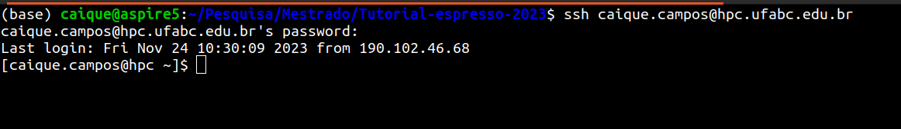
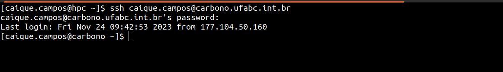
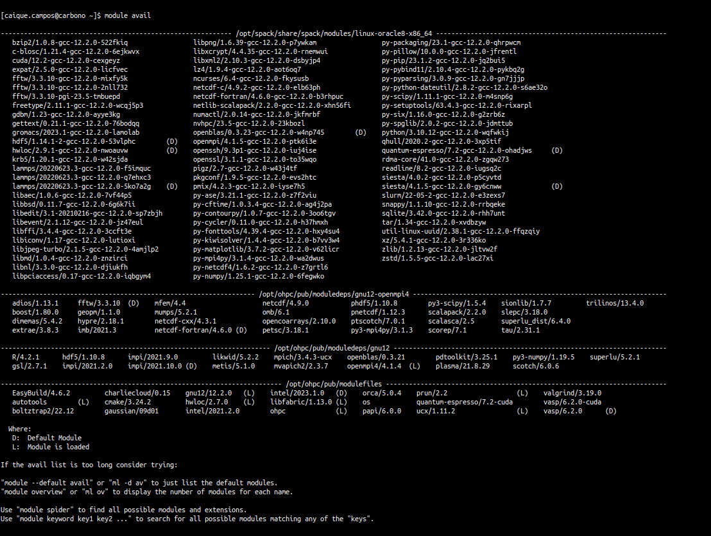
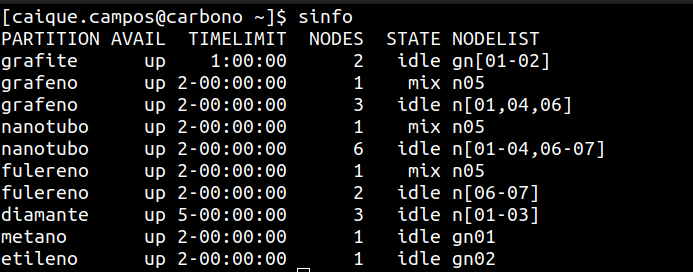

## Parte 2: Utilizando o Cluster Carbono para Realização das Simulações

As simulações de cálculos de primeiros princípios com o Quantum Espresso demandam muitos recursos computacionais (poder de processamento, memória, etc). Para melhorar a eficiência das simulações, a maioria dos softwares que implementam métodos computacionais para cálculos de estrutura eletrônica o fazem de forma a explorar computação paralela. Embora os cálculos apresentados nesse tutorial possam ser rodados em um laptop pessoal, cotidianamente as simulações são realizadas em computadores de alta performance: workstations e supercomputadores (clusters).

A UFABC atualmente conta com dois computadores de alto desempenho: os clusteres **titânio** e o mais novo cluster **carbono**. Mais informações sobre esses equipamentos (e.g. especificação de hardware) podem ser enontradas em [https://ccm.propes.ufabc.edu.br/equipamentos/](ccm.propes.ufabc.edu.br/equipamentos).

Neste mini tutorial serão demonstrados como acessar e utilizar o cluster carbono para realização de cálculos de estrutura eletrônica com o software Quantum Espresso. Este tutorial é uma continuação direta do tutorial [Estrutura Eletrônica do Grafeno](./ESPRESSO.md)

Este tutorial assume que os leitores estão utilizando uma distribuição linux (e.g. ubuntu) e portanto todas as instruções serão dadas via terminal de comando. A razão é que ambos os clusteres da UFABC utilizam uma distribuição linux como sistema operacional. 

**IMPORTANTE:** as informações apresentadas aqui não substituem o treinamento fornecido pela CCM-UFABC para utilizar os recursos computacionais. Mais ainda, informações oficiais sobre como acessar o cluster, o sistema de gerenciamento de filas e softwares disponíveis para a comunidade podem ser obtidas em [https://ccm.propes.ufabc.edu.br/tutoriais-de-acesso-a-titanio/](https://ccm.propes.ufabc.edu.br/tutoriais-de-acesso-a-titanio/).

### Acessando o cluster carbono:

O acesso ao cluster pode ser feito por meio do protocolo ssh. O usuário que possui vpn pode acessar diretamente os clusteres. Caso contrário, deve-se logar no gate (hpc.ufabc.edu.br):
```bash
ssh <login-usuario>@hpc.ufabc.edu.br
```



Logado no gate HPC, o usuário pode prosseguir para o login no cluster carbono:
```bash
ssh <login-usuario>@carbono.ufabc.int.br
```


Agora, o usuário se encontra em sua área de trabalho no cluster. Aqui, ele pode gerenciar seus arquivos e diretórios bem como visualizar os softwares disponíveis no cluster, filas e jobs em execução:





### O SLURM:

O gerenciamento dos recursos do cluster e a organização das tarefas executadas pelos usuários(jobs) é feita com um sistema de filas, o [SLURM Workload Manager](https://slurm.schedmd.com/quickstart.html). As tarefas realizadas pelos usuários (simulações, programas e script) são executadas por meio da submissão de jobs para as filas disponíveis. Os softwrares, bibliotecas são disponibilizados para os usuários por meio de módulos (que podem ser consultados com o comando `module avail`), que devem ser devidamente carregados antes da submissão do job.

Na prática, para submeter um job o usuário pode utilizar um arquivo `bash` com as intruções do SLURM que especificam:
- Os recursos (número de cores, memória e tempo de execução);
- A fila onde o job será executado;
- Lista de módulos a serem utilizados na execução do job;
- Instruções para a execução das tarefas (arquivos de entrada do software/programa/script);

Abaixo, um exemplo de script com o cabeçalho contendo as instruções para o SLURM:
```bash
#!/bin/bash                  <---"Shebang": especifica qual interpretador utilizar (nesse caso: bash shell)
#SBATCH --job-name=t-cpu     <--- Nome do job que aparecerá na fila
#SBATCH --nodes=1            <--- Nós requisitados
#SBATCH --ntasks-per-node=16 <--- Número de tarefas executadas em um nó
#SBATCH --ntasks=16          <--- Controla o número máximo de tarefas que serão executadas utilizando os recursos alocados
#SBATCH --mem=64gb           <--- Memória total solicitada para realização do job 
#SBATCH --time=24:00:00      <--- Tempo máximo de execução do job (deve respeitar os limites da fila!!!)
#SBATCH -p grafeno           <--- Fila onde o job será executado

# Carregar todos os módulos necessários para a realização do job (softwares, bibliotecas, etc):
module load openmpi/4.1.5-gcc-12.2.0-ptk6i3e
module load quantum-espresso/7.2-gcc-12.2.0-ohadjws

# Instruções para rodar o software quantum espresso, utilizando 16 cores em paralelo 
# usando como entrada o arquivo espresso.pwi e escrevendo a saida no arquivo espresso.pwo:
mpirun -np 16 pw.x -inp espresso.pwi >> espresso.pwo
```
O script acima pode ser utilizado como template para rodar jobs mais elaborados, como por exemplo executar uma sequência de operações (ou simulações) em loop. As instruções do job são feitas usando `bash`. A documentação completa do SLURM incluindo mais opções de personalização e descrição de todas as flags está disponível em: [https://slurm.schedmd.com/sbatch.html](https://slurm.schedmd.com/sbatch.html).


### Utilizando o Quantum Espresso na Carbono:

Agora vamos juntar as informações de ambos os tutoriais para rodar as contas de estrutura eletrônica no cluster carbono.

Primeiro, vamos copiar todos os arquivos necessários para um diretório na carbono. Os inputs do quantum espresso estão disponíveis nesse repositório (pasta `electronic-structure`):

```
./electronic-stucture
    |
    -SCF
        |
        - graphene.scf.pwi
    -NSCF
        |
        - graphene.nscf.pwi
    -BANDS
        |
        - graphene.bands.pwi
        - graphene.bands-pp.pwi
    -DOS
        |
        - projwfc.pwi
```
Os arquivos podem ser transferidos para o cluster carbono com o `scp`. Entretanto, na ausência do use de um VPN, os arquivos devem ser copiados para o gate para depois serem transferidos para a carbono:

```
<usuario>@local~: scp -r ./electronic-structure <usuario>@hpc.ufabc.edu.br:~/

<usuario>@hpc~: scp -r ./electronic-structure <usuario>@hpc.ufabc.edu.br:~/
```

Com os inputs do espresso, precisamos também dos arquivos contendo os pseudopotenciais dos átomos. É uma prática muito comum deixar os pseudopotenciais em um diretório no cluster e modificar o caminho nos respectivos inputs. Assim, se mantem apenas uma cópia desses arquivos otimizando a utilização do espaçono cluster. A transferência dos arquivos pode ser via ssh, copiando os arquivos localmente ou por meio do comando `wget`. 

Existem várias bibliotecas com pseudopotenciais disponíveis para uso no Quantum Espresso disponíveis no próprio [site do software](https://www.quantum-espresso.org/pseudopotentials/). Aqui vamos utilizar os pseudopotenciais para o carbono disponíveis em [https://pseudopotentials.quantum-espresso.org/legacy_tables/ps-library/c](https://pseudopotentials.quantum-espresso.org/legacy_tables/ps-library/c). Mais especificamente, vamos utilizar o pseudopotencial kjpaw: `C.pbe-n-kjpaw_psl.1.0.0.UPF`.

**Caso 1: Copiando os arquivos localmente:**

Os pseudopotenciais necessário para o calculo da estrutura eletrônica do grafeno encontra-se no diretório `pseudos`. Portanto, basta copiar esse arquivo para a carbono:

```
<usuario>@local~: scp -r pseudos <usuario>@hpc.ufabc.edu.br>:~/

<usuario>@hpc~: scp -r pseudos <usuario>@carbono.ufabc.int.br>:~/
```

**Caso 2: Obtendo os pseudopotenciaos com o `wget`:**

O arquivo do pseudopotencial `C.pbe-n-kjpaw_psl.1.0.0.UPF` pode ser obtido no link [https://pseudopotentials.quantum-espresso.org/upf_files/C.pbe-n-kjpaw_psl.1.0.0.UPF](https://pseudopotentials.quantum-espresso.org/upf_files/C.pbe-n-kjpaw_psl.1.0.0.UPF). Com o wget, faremos download do arquivo diretamente no diretório atual:


```
<usuario>@carbono~/pseudos: wget https://pseudopotentials.quantum-espresso.org/upf_files/C.pbe-n-kjpaw_psl.1.0.0.UPF
```


As versões do espresso disponíveis no cluster podem ser consultadas com o comando `mudule avail`. Atualmente, a Carbono conta com as seguintes compilações do espresso:

- Quantum Espresso 7.2 (CPU);
- Quantum Espresso 7.2 cuda (GPU);

Cada módulo contém uma lista de dependências de outros módulos que precisam ser carregados antes de poder utilizar o software.

**1. Rodando o Quantum Espresso na CPU:**

No caso da versão para CPU, os módulos necessários são:
```
module load openmpi/4.1.5-gcc-12.2.0-ptk6i3e
module load quantum-espresso/7.2-gcc-12.2.0-ohadjws
```

O exemplo de script para o SLURM para rodar o cálculo de SCF para o grafeno é exemplificado abaixo:
```bash
#!/bin/bash
#SBATCH --job-name=scf
#SBATCH --nodes=1
#SBATCH --ntasks-per-node=16
#SBATCH --ntasks=16
#SBATCH -p grafeno

module load openmpi/4.1.5-gcc-12.2.0-ptk6i3e
module load quantum-espresso/7.2-gcc-12.2.0-ohadjws

export OMP_NUM_THREADS=1

mpirun -np 16 pw.x -inp graphene.scf.pwi >> graphene.scf.pwo
```

**2. Rodando o Quantum Espresso na GPU:**

No caso da compilação em GPU, é necessário carregar o módulo cuda e a versão do espresso com compilação para GPU:

```
module load cuda/12.2-gcc-12.2.0-cexgeyz
module load quantum-espresso/7.2-cuda  
```

Para o SLURM, algumas modificações precisam ser feitas: (i) para rodar com GPU, o SLURM passa os processo para a GPU que é responsável por gerenciar os processos. Nesse sentido, não devemos criar muitos processos do mpi (no máximo 2), pois a velocidade de comunicação da CPU com a GPU é limitada e muitos processos podem desacelerar o cálculo. (ii) Incluir a flag `gres` (gerenciamento de recursos) para solicitar 2 gpus:

```bash
#!/bin/bash
#SBATCH --job-name=scf
#SBATCH --nodes=1
#SBATCH --ntasks-per-node=2
#SBATCH --gres=gpu:2       
#SBATCH -p gpu             

module purge

module load openmpi/4.1.5-gcc-12.2.0-ptk6i3e
module load cuda/12.2-gcc-12.2.0-cexgeyz
module load quantum-espresso/7.2-cuda  

export OMP_NUM_THREADS=1

mpirun pw.x -inp graphene.scf.pwi >> graphene.scf.pwo
```
Comparar a saída do cálculo usando CPU vs GPU;

**[Voltar para o início](./README.md)**
**Parte 2: [Usando o cluster carbono](./SLURM.md)**